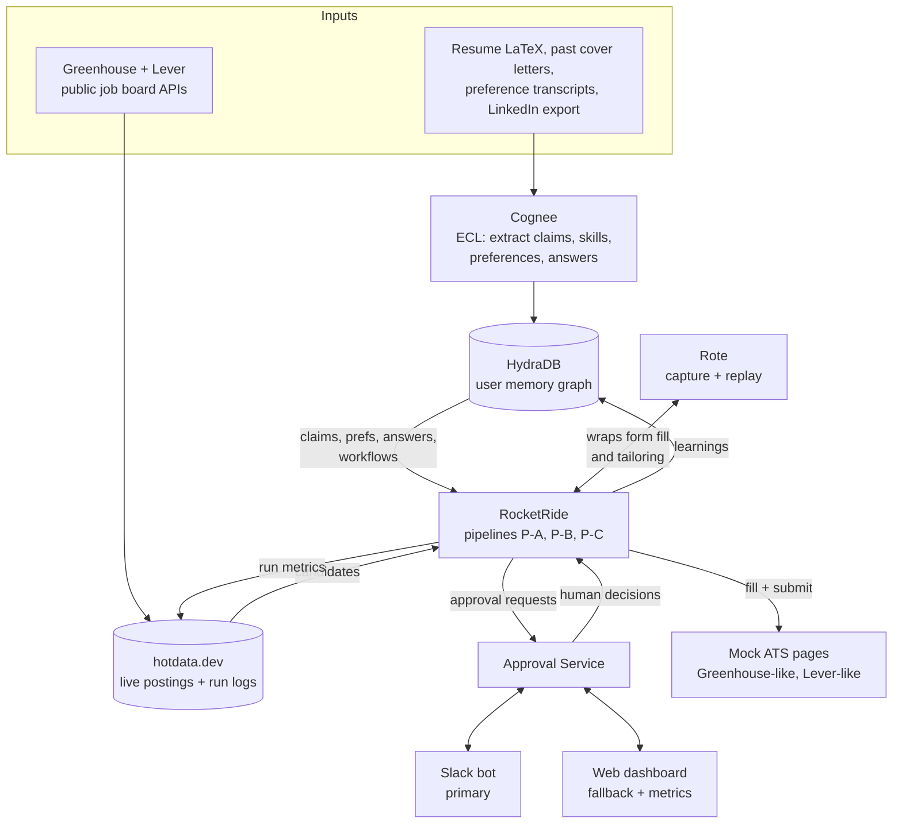

# Second Nature: A Job Agent That Earns Its Autonomy

**Working name:** Second Nature (placeholder, rename freely)
**Event:** Data and AI Hackathon, "From Memory to Muscle Memory," AWS Builder Loft, Sep 11, 2026
**Doc status:** v0.1 draft for team review
**Owners:** TBD per section (see §12)

---

## 0. Instructions for Claude Code

- Build the core system (§1–§13) first, in the order given in §12.
- **§15 (Outcome Intelligence) is optional and gated.** Do not scaffold, stub, or install anything for it during the core build. When you reach it, or when proof moments P1–P7 all pass, **stop and ask the user the gate question in §15.0** before writing any code for it.
- When a detail in this spec conflicts with what a sponsor tool actually supports, follow the fallback in §13 and tell the user what changed.
- Respect the non-goals in §2 even if implementing them looks easy.

---

## 1. One-line pitch

A job-search agent that sources roles, learns what you want from how you react, tailors your resume and cover letter from facts it has verified about you, and applies. Every application makes the next one faster, cheaper, and less dependent on you, until it earns the right to apply on its own.

## 2. Goals and non-goals

### Goals

- **G1. Source** relevant roles continuously from live public job boards.
- **G2. Remember** verified facts about the user (claims, metrics, standard answers) with provenance.
- **G3. Learn preferences** from approve, reject, and edit signals, confirmed by the user before they take effect.
- **G4. Tailor** a one-page resume and a cover letter per job using only verified claims.
- **G5. Apply** by filling ATS forms, with a human approval gate by default.
- **G6. Compound visibly:** tokens, seconds, and user questions per application trend down across runs.
- **G7. Earn autonomy:** approvals are the training phase, not the product. Once its track record shows it agrees with the user, the agent asks to act on its own, and the user switches it on per domain (F10).

### Non-goals (for the hackathon)

- Submitting to real company ATSs. All submissions go to mock ATS pages we control.
- LinkedIn scraping or Easy Apply automation (ToS violation, CAPTCHA risk).
- Writing new resume bullets. The agent selects and orders; it never invents.
- CAPTCHA handling, account creation on job sites, or storing third-party passwords.
- Multi-user onboarding UX. The schema is multi-user-ready; the product runs for one user.
- Any resume or cover letter change driven by outcome data without either explicit user confirmation or autopilot enabled by the user for that domain (see F10, §15).

## 3. Proof moments (demo acceptance criteria)

Every flow in this spec exists to produce at least one of these. If a feature does not feed one, cut it.

| # | Proof moment | What judges see | Layers involved |
|---|---|---|---|
| P1 | "It stopped asking me things" | Questions-to-user per application: ~6 on run 1, 0 by run ~6 | Cognee, HydraDB |
| P2 | "It learned what I want" | After 3 similar rejections, Slack proposes a preference rule; after confirming, ranking visibly reorders | Cognee, HydraDB, hotdata.dev |
| P3 | "Muscle memory" | Second Greenhouse-style form fills in seconds via Rote replay, near-zero LLM tokens | Rote, RocketRide |
| P4 | "Partial muscle memory" | A form with one new custom question replays known fields and sends only the new field to the LLM | Rote, RocketRide |
| P5 | "It never lies" | A JD asks for a skill with no evidence; agent flags the gap instead of claiming it | HydraDB, Cognee |
| P6 | "It earned autonomy" | The agent posts an autopilot prompt backed by its agreement record; the user toggles it on and the next applications go out with zero human touches | HydraDB, RocketRide, hotdata.dev |
| P7 | The chart | Tokens, seconds, and questions per application plotted across all runs | hotdata.dev |
| P8 *(optional, §15)* | "It closed the loop" | A rejection email arrives, the tracker updates, a feedback prompt follows, and the next resume for a similar role visibly reorders after confirmation | All layers |

## 4. System overview



### The three memories

| Memory type | Hackathon term | What it holds | Lives in |
|---|---|---|---|
| Semantic | Memory | Facts about the user: claims, metrics, skills, standard answers | Cognee to HydraDB |
| Episodic to preference | Memory | Every approve, reject, edit; hypotheses; confirmed rules | HydraDB |
| Procedural | Muscle memory | How to fill a given ATS form; how to run the tailoring pipeline | Rote, indexed in HydraDB |

### Pipeline split at human gates

RocketRide pipelines never block waiting for a human. Each human decision starts a new pipeline. This keeps runs short, restartable, and cleanly capturable by Rote.

| Pipeline | Trigger | Ends with |
|---|---|---|
| **P-A: Source and surface** | Schedule (every 30 min) or manual refresh | Job cards posted to Slack, or P-B started directly if D1 is Autonomous |
| **P-B: Tailor and draft** | User approves a job card, or D1 autopilot selects it | Draft package posted to Slack |
| **P-C: Fill and submit** | User approves draft, or D2 is Autonomous for this category | Submission logged, learnings written |

## 5. Layer responsibilities

Each layer has an explicit "owns / does not own" contract. Overlap between layers is the most common integration failure, and judges check that each tool does distinct, real work.

### 5.0 At a glance

| Tool | Does, in one line | Used in |
|---|---|---|
| 🧩 **Cognee** | Turns messy text (resume, transcripts, JDs, emails) into typed facts: Claims, Skills, Metrics, Requirements | F1, F3, F4, O1, O3 |
| 🗄 **HydraDB** | Stores the durable per-user graph and answers relationship questions across it — claim-to-requirement matches, prior answers, preferences, workflow index | F1, F3–F9, O1, O4 |
| ⚡ **hotdata.dev** | Holds the live firehose of postings and runs the fast filter/search/analytics queries over it, including the metrics tables | F1–F3, F8, F9, O1, O2 |
| 🚀 **RocketRide** | Orchestrates every pipeline — sequences the tool calls, LLM calls, Slack messages, and write-backs that make each flow actually run | F1–F9, O1, O3, O4 |
| 🔁 **Rote (Modiqo)** | Watches a successful run once, then replays it deterministically — form fills, resume rendering, email triage — skipping the LLM on repeat | F6, F8, F9, O1, O4 |
| 🛡 **Snyk** | Scans code and dependencies at every build checkpoint (§12: H3, H5, H7), not just once at the end | Build plan, §9 |

Full "owns / does not own" contracts below; §7 shows the same tools in context, step by step, inside each flow.

### 5.1 Cognee: memory construction

- **Owns:** Ingesting unstructured user material (resume, cover letters, transcripts, edits, rejection reasons in free text) and extracting entities: Claim, Skill, Metric, Project, Employer, PreferenceSignal, StandardAnswer. Using `remember` / `recall` so each user interaction becomes a durable memory unit.
- **Also owns:** Extracting structured requirements from job descriptions (required skills, nice-to-haves, seniority, location, sponsorship language) for jobs that enter the graph.
- **Does not own:** Deciding preferences (app logic does that), storing the canonical graph long-term (HydraDB does), or bulk job listings (hotdata.dev does).
- **Inputs:** Files, Slack free-text replies, edit diffs. **Outputs:** Entities and relationships written to HydraDB.

### 5.2 HydraDB: memory storage and serving

- **Owns:** The durable, per-user graph. Multi-hop Cypher queries for matching claims to requirements, retrieving prior answers to similar questions, preference rules, workflow index, application history.
- **Does not own:** The live firehose of postings, or analytics over run metrics (both hotdata.dev).
- **Rule:** A job enters HydraDB only when someone acts on it (scored above threshold and surfaced, approved, rejected, or applied to). The graph holds what matters, not everything that exists.

### 5.3 hotdata.dev: live query and analytics

- **Owns:**
  - The postings table: all fetched jobs, with hard-filter SQL (location, role type, recency, sponsorship keywords), full-text search, vector similarity against the user's profile embedding, and geo radius from the user's base location.
  - The run log table: one row per pipeline run, powering the compounding chart (P7) and autonomy thresholds.
- **Does not own:** Anything relationship-shaped about the user (HydraDB).

### 5.4 RocketRide: motion and orchestration

- **Owns:** Pipelines P-A, P-B, P-C. Sequencing tool calls, LLM calls, Slack messages, form fills, and write-backs to HydraDB and hotdata.dev.
- **Does not own:** Remembering how a task was done (Rote), or deciding what is worth remembering (Cognee).

### 5.5 Rote (Modiqo): muscle memory

- **Owns:** Capturing successful runs of two task types and replaying them deterministically:
  1. **Form fill** per ATS form fingerprint (see §6.3).
  2. **Resume tailoring render loop** (select bullets, render, check page count, trim, re-render).
- **Does not own:** Novel reasoning. Any field or step without a captured path falls back to the LLM through RocketRide.

### 5.6 Snyk: security

- **Owns:** Scanning code and dependencies throughout the build, not only at the end. Key risks in this app: PII in resume data, secrets in env files, unsanitized job description HTML rendered in the dashboard (XSS), and prompt injection inside job descriptions (see §9).

### 5.7 App components we build

| Component | Purpose |
|---|---|
| **Approval Service** | Small backend holding the approval queue. Interface-agnostic: Slack and the dashboard are both clients. Starts P-B and P-C on decisions. |
| **Slack bot** | Bolt SDK in Socket Mode (no public URL needed). Job cards, draft reviews, preference confirmations, questions to user. |
| **Web dashboard** | Metrics chart, graph view, and a fallback approval queue if Slack slips. |
| **Mock ATS** | 3 local form pages: Greenhouse-like A, Greenhouse-like B (one extra custom question, for P4), Lever-like. Shared submit endpoint that logs payloads. |
| **Renderer** | LaTeX to PDF for resumes (tectonic or pdflatex), plus page-count check. |

## 6. Data model

### 6.1 Multi-user readiness

- Every node carries `user_id`. Every Cypher query takes `$user_id` as a parameter; no query runs without it.
- User config (base location, Slack channel, autonomy thresholds) lives on the `User` node, never hardcoded.
- Secrets are per-deployment env vars in v1; per-user secret storage is out of scope.

### 6.2 Nodes

| Node | Key fields | Notes |
|---|---|---|
| `User` | user_id, name, base_location, slack_channel, created_at | One in v1 |
| `Claim` | claim_id, text, type (bullet, summary, fact), status (unverified, verified, retired), source_doc, verified_at | Resume bullets are Claims. Only `verified` Claims are usable in tailoring. |
| `Metric` | value, unit, context | e.g., 44% resubmission reduction |
| `Skill` | name, canonical_name | Normalized so "LLM evals" and "AI evals" merge |
| `Project` / `Employer` | name, dates, role | |
| `Evidence` | source_doc, excerpt_ref | Provenance for a Claim |
| `Job` | job_id, source (greenhouse, lever), external_id, title, company, url, ats_type, fetched_at | Only jobs someone acted on |
| `Requirement` | text, kind (required, preferred), skill_ref | Extracted by Cognee from JD |
| `Company` | name, size_bucket, industry, ats_type | |
| `Application` | app_id, status (drafted, approved, submitted, rejected_by_user), mode (first_run, partial_replay, full_replay), edit_rate, submitted_at, decided_by (user, agent) | |
| `Question` | question_id, canonical_text, embedding, scope (global, company, role_type) | Canonicalized screening question |
| `Answer` | answer_id, text, source (user, generated, reused), approved | |
| `Signal` | signal_id, kind (approve, skip, not_for_me, edit), reason_text, reason_tags, created_at | Raw episodic event |
| `Preference` | pref_id, rule (structured), status (hypothesis, active, rejected), confidence, evidence_count | See F5 |
| `Workflow` | workflow_id, rote_ref, task_type (form_fill, tailor_render), ats_type, form_fingerprint, field_labels, success_count, last_used | Index of Rote captures |
| `Gap` | skill_ref, job_ref | Requirement with no supporting verified Claim |
| `AutonomyState` | domain, scope, state (supervised, ready, autonomous), readiness_value, last_prompted_at, decisions_since_prompt, recent_overrides | One per domain and scope (F10) |

### 6.3 Key edges

```
(User)-[:HAS_CLAIM]->(Claim)-[:SUPPORTED_BY]->(Evidence)
(Claim)-[:DEMONSTRATES]->(Skill)
(Claim)-[:HAS_METRIC]->(Metric)
(Claim)-[:FROM]->(Project|Employer)
(Job)-[:POSTED_BY]->(Company)
(Job)-[:REQUIRES]->(Requirement)-[:ABOUT]->(Skill)
(User)-[:GAVE]->(Signal)-[:ON]->(Job)
(Preference)-[:INFERRED_FROM]->(Signal)
(User)-[:HOLDS]->(Preference)
(Application)-[:FOR]->(Job)
(Application)-[:BY]->(User)
(Application)-[:USED_CLAIM]->(Claim)
(Application)-[:ANSWERED]->(Question)-[:WITH]->(Answer)
(Application)-[:EXECUTED_BY]->(Workflow)
(Job)-[:HAS_GAP]->(Gap)
(User)-[:HAS_AUTONOMY]->(AutonomyState)
```

**Form fingerprint:** `hash(ats_type + sorted(normalized_field_labels))`. Matching rules:

| Match | Condition | Mode |
|---|---|---|
| Exact | Same fingerprint | Full replay |
| Partial | Same ats_type and ≥70% label overlap | Replay known fields, LLM for the rest (P4) |
| None | Otherwise | First run with Rote capture |

### 6.4 Representative Cypher queries

Claims that cover a job's requirements (drives tailoring and P5):

```cypher
MATCH (j:Job {job_id: $job_id})-[:REQUIRES]->(r:Requirement)-[:ABOUT]->(s:Skill)
OPTIONAL MATCH (u:User {user_id: $user_id})-[:HAS_CLAIM]->(c:Claim {status: 'verified'})-[:DEMONSTRATES]->(s)
RETURN r.text, r.kind, collect(c.claim_id) AS supporting_claims
```

Reuse a prior answer to a similar question at a similar company:

```cypher
MATCH (u:User {user_id: $user_id})<-[:BY]-(a:Application)-[:ANSWERED]->(q:Question)-[:WITH]->(ans:Answer {approved: true}),
      (a)-[:FOR]->(:Job)-[:POSTED_BY]->(co:Company)
WHERE q.question_id IN $similar_question_ids AND co.industry = $industry
RETURN ans.text, q.scope, co.name ORDER BY a.submitted_at DESC LIMIT 3
```

Active preference rules for ranking:

```cypher
MATCH (u:User {user_id: $user_id})-[:HOLDS]->(p:Preference {status: 'active'})
RETURN p.rule, p.confidence
```

---

## 7. Flows

Each flow lists its trigger, steps with the owning layer, what it writes back, and failure handling.

### F1. Onboarding and ingestion

**Trigger:** User uploads files or runs `/secondnature onboard` in Slack.

| Step | Layer | Action |
|---|---|---|
| 1 | App | Accept resume (.tex preferred), past cover letters, a preferences transcript, optional LinkedIn export |
| 2 | Cognee | ECL pipeline extracts Claims, Metrics, Skills, Projects, Employers, StandardAnswers (work authorization, graduation date, start date, relocation) |
| 3 | HydraDB | Write nodes and edges. Resume bullets from the user's own resume enter as `verified` (the user wrote and stands behind them). Everything else enters as `unverified`. |
| 4 | RocketRide + Slack | Post a verification digest: unverified Claims and StandardAnswers with Confirm / Fix / Discard buttons |
| 5 | Cognee | Build a profile embedding from verified Claims; store in hotdata.dev for vector ranking |

**Writes:** Claims, Evidence, StandardAnswers, profile embedding.
**Failure:** If extraction misses a field, it surfaces later as a question to the user (F8), which is fine and feeds P1.

### F2. Job sourcing (Pipeline P-A, part 1)

**Trigger:** Schedule every 30 minutes, or `/secondnature refresh`.

| Step | Layer | Action |
|---|---|---|
| 1 | RocketRide | Fetch postings from a curated list of company boards via public APIs (Greenhouse: `boards-api.greenhouse.io/v1/boards/{token}/jobs?content=true`; Lever: `api.lever.co/v0/postings/{company}?mode=json`) |
| 2 | hotdata.dev | Upsert into `postings` keyed on (source, external_id). Store title, company, location, raw description, posted_at, ats_type |
| 3 | hotdata.dev | Embed new postings for vector search |

**Writes:** `postings` rows.
**Failure:** Board fetch errors are logged and skipped; one failing company never blocks the run.
**Seed plan:** 20–40 company board tokens chosen for the demo user's target roles, fetched in hour 1 so real data exists early.

### F3. Scoring and ranking (Pipeline P-A, part 2)

**Trigger:** New postings land.

Scoring is two-stage so hotdata.dev and HydraDB each do distinct work.

| Step | Layer | Action |
|---|---|---|
| 1 | hotdata.dev | **Hard filters** (SQL): role type, location or radius, posted within N days, exclude postings with disqualifying sponsorship language, exclude jobs already signaled on |
| 2 | hotdata.dev | **Candidate shortlist:** top 30 by vector similarity to profile embedding |
| 3 | Cognee | Extract Requirements from shortlisted JDs |
| 4 | HydraDB | **Fit score:** share of required Requirements with supporting verified Claims (query in §6.4); record Gaps |
| 5 | HydraDB | Apply active Preference rules as boosts or penalties |
| 6 | RocketRide | `score = 0.45 * requirement_coverage + 0.30 * vector_similarity + 0.25 * preference_fit`; surface top 5 as Slack job cards |

**Writes:** Surfaced Jobs, Requirements, Gaps to HydraDB.
**Weights** are starting values; tune during hours 6–7 using real reactions.

### F4. Review and feedback

**Trigger:** Job card posted.

Job card contents: title, company, location, score, top 3 reasons (matched Claims), gaps, link.
Buttons: **Apply** / **Skip** / **Not for me** (opens a modal with reason chips like "too senior," "company too large," "wrong domain," "location," plus free text).

| Step | Layer | Action |
|---|---|---|
| 1 | Approval Service | Record decision |
| 2 | Cognee | Extract structured reason tags from free text |
| 3 | HydraDB | Write `Signal` node linked to Job |
| 4 | RocketRide | On **Apply**, start P-B. On **Not for me**, run F5 check |

"Skip" means "not now" and carries no preference weight. Only "Not for me" teaches.

### F5. Preference learning

**Trigger:** Any new Signal with reason tags.

| Step | Layer | Action |
|---|---|---|
| 1 | HydraDB | Count Signals sharing a reason tag or a shared attribute (company size bucket, industry, seniority, location) in the last 20 signals |
| 2 | RocketRide | If evidence_count ≥ 3 and no rejected Preference exists for the same rule, create a `Preference {status: hypothesis}` |
| 3 | Slack | "I think you prefer companies under 2,000 people, based on 3 rejections (Company X, Y, Z). Confirm?" **Confirm** / **Not quite** |
| 4 | HydraDB | Confirm sets `active`. Not quite sets `rejected` so it is never proposed again |
| 5 | RocketRide | Re-rank the current shortlist and post the reordered top 5 (P2) |

**Rule:** Preferences never change behavior until the user confirms. Rules are structured (`{field: company_size_bucket, op: lt, value: 2000, effect: penalty, weight: 0.5}`), not prose, so they can be applied in SQL or Cypher deterministically.

### F6. Resume tailoring (Pipeline P-B, part 1)

**Trigger:** User taps **Apply** on a job card.

Tailoring means **selection and ordering of verified Claims**. The agent never writes a new bullet.

| Step | Layer | Action |
|---|---|---|
| 1 | HydraDB | Fetch Requirements, supporting Claims, Gaps |
| 2 | RocketRide (LLM) | Choose which experiences and projects to include, bullet order within each, one of the pre-approved summary variants, and skills ordering. Output is a list of claim_ids, not text |
| 3 | Renderer | Assemble LaTeX from the base template plus selected Claims; compile to PDF |
| 4 | Renderer | Check page count. If > 1, drop the lowest-relevance bullet and re-render. Repeat until 1 page |
| 5 | Rote | First successful run is captured as a `tailor_render` Workflow. Later runs replay steps 3–4 deterministically; only step 2 needs the LLM |

**Writes:** `Application {status: drafted}` with `USED_CLAIM` edges.
**Stretch:** light keyword alignment (e.g., JD says "experimentation," Claim says "A/B testing") shown as a diff for approval, never silent.

### F7. Cover letter generation (Pipeline P-B, part 2)

| Step | Layer | Action |
|---|---|---|
| 1 | HydraDB | Top 3 Claims by requirement coverage, plus Company facts |
| 2 | RocketRide (LLM) | Generate 3 short paragraphs. Every factual sentence must end with a citation tag `[claim:ID]` or `[jd]` |
| 3 | Validator | Every cited claim_id exists, is verified, and belongs to this user. Any factual sentence without a citation fails. Style rules enforced (no em dashes, length cap) |
| 4 | RocketRide | On validation failure, regenerate once with the failure reasons; on second failure, flag for user |
| 5 | Renderer | Strip citation tags, render PDF |

**Writes:** Cover letter text and citations on the Application.

### F8. Application, first run (Pipeline P-C, capture mode)

**Trigger:** User approves the draft package, and no matching Workflow exists for this form fingerprint.

Draft package in Slack: resume PDF, cover letter, screening answers, and a list of anything the agent needs from the user. Buttons: **Submit** / **Edit** (modal) / **Discard**.

Screening answer resolution order, per question:

1. **StandardAnswer** (global facts: work authorization, graduation date) → auto-filled, no LLM
2. **Prior approved Answer** to a similar Question at a similar company (§6.4 query) → reused as draft
3. **Generated** from Claims → marked generated, requires approval
4. **Unknown fact** → asked to the user in Slack. The answer is stored as a StandardAnswer so it is never asked again (P1)

| Step | Layer | Action |
|---|---|---|
| 1 | RocketRide | Open mock ATS form, read field labels, compute fingerprint |
| 2 | HydraDB | Look up Workflow by fingerprint: none found |
| 3 | RocketRide (LLM) | Map each field to a data source (StandardAnswer, Claim, file upload, Answer) and fill |
| 4 | Rote | Capture the full successful fill-and-submit path |
| 5 | HydraDB | Write `Workflow` node with fingerprint, field labels, rote_ref |
| 6 | hotdata.dev | Write run log row (§10) |

### F9. Application, replay (Pipeline P-C, replay mode)

**Trigger:** Same as F8, but a Workflow matches.

| Step | Layer | Action |
|---|---|---|
| 1 | HydraDB | Fingerprint lookup returns exact or partial match |
| 2 | Rote | Replay captured path with this application's values bound as parameters |
| 3 | RocketRide (LLM) | Partial match only: handle unmatched fields; after success, Rote captures the extended path as a new Workflow version |
| 4 | HydraDB + hotdata.dev | Increment success_count; write run log with mode `full_replay` or `partial_replay` |

**Failure:** If replay fails (field moved, validation error), fall back to F8 for this run and mark the Workflow `stale`. Never submit a partially filled form.

### F10. Autonomy framework

Every decision type starts supervised. The agent earns autonomy **per decision domain** by building a track record of agreeing with the user, asks for permission once it is ready, and acts alone only after the user switches it on.

**Readiness comes from the user's track record, not the model's self-reported confidence.** LLM confidence scores are poorly calibrated; "you agreed with 13 of my last 15 picks" is a fact the user can check.

#### Domains

| Domain | What the agent decides alone | Readiness metric | Ready when |
|---|---|---|---|
| D1 Job selection | Which surfaced jobs to apply to (true auto-apply), per role cluster | Share of the agent's top picks the user approved, last 15 cards | ≥ 85% |
| D2 Submission | Submit drafts without review, per (ats_type, role_type) | Edit rate and discards, last 5 applications | Edit rate < 10%, 0 discards |
| D3 Screening answers | Use generated free-text answers without review | Generated answers approved unedited, last 10 | ≥ 90% |
| D4 Preferences | Activate inferred preference rules without confirmation | Hypotheses confirmed, last 5 | ≥ 4 of 5 |
| D5 Experiments *(§15)* | Promote winners, retire losers, start the next experiment | Experiment proposals accepted, last 3 | 3 of 3 |
| D6 Claim weights *(§15)* | Apply feedback-based ClaimWeights | Proposals confirmed, last 5 | ≥ 4 of 5 |
| D7 Email matching *(§15)* | Resolve ambiguous email-to-application matches | Agent's suggested match accepted, last 10 | ≥ 90% |

Thresholds are starting values stored on the `User` node. Demo values may be lowered so readiness is reachable in one session.

#### States

`Supervised → Ready → Autonomous`, with downgrades back to `Supervised`.

- **Supervised:** every decision goes through approval. Each approval, edit, or rejection updates the readiness metric.
- **Ready:** the threshold is met. The agent posts one readiness prompt and keeps asking for approval until the user answers.
- **Autonomous:** the agent acts without consulting and reports after the fact.

#### Readiness prompt (Slack)

> "You've agreed with 13 of my last 15 job picks for AI PM roles (87%). I'm confident enough to pick and apply to these on my own. You'll get a daily digest of everything I did, and you can turn this off anytime with `/secondnature autopilot off`. **Turn on autopilot** / **Not yet**"

- **Anti-nag rule:** after "Not yet," do not re-prompt that domain until 10 more decisions are logged or 3 days pass.
- If several domains become ready together, bundle them into one message with a toggle per domain.

#### Toggle commands

```
/secondnature autopilot                     # status: state + readiness per domain
/secondnature autopilot on <domain|ready>   # enable one domain, or every domain currently Ready
/secondnature autopilot off <domain|all>    # immediate; returns domain(s) to Supervised
```

The dashboard mirrors these as switches. The user may force-enable a domain that is not yet Ready; the agent shows its current readiness number and asks for one confirmation before complying.

#### Acting autonomously: inform, don't consult

- Every autonomous decision is logged with `decided_by: agent` and appears in a **daily digest** and the dashboard's live feed.
- Reversible decisions (preference rules, ClaimWeights, variant promotion) get an **Undo** button in the digest.
- Irreversible decisions (submissions) use a **hold window**: "Submitting to Company X in 10 min. **Hold**." This is a passive veto, not an approval request: no response means it proceeds. Demo value: 30 seconds.

#### Automatic downgrade

- Any undo, hold, or post-hoc edit of an autonomous decision counts as an override.
- 2 overrides in the last 10 autonomous decisions in a domain return it to Supervised, with an explanation ("You undid 2 of my last 10 preference changes, so I'll check with you again for a while.").
- D2 also keeps a hard rule: any application with edit rate > 25% downgrades that category.

#### Never autonomous

The agent can earn autonomy over **judgment calls**, but not over **facts about the user**, because facts cannot be learned by watching.

- Adding or changing Claims, StandardAnswers, or any fact about the user. An unknown fact is always asked.
- Protected companies (a user-maintained dream list): always Supervised in D1 and D2, and excluded from experiments.
- Submissions to real ATSs during the hackathon (non-goal). Autonomous submission is allowlisted to mock endpoints.
- Expanding its own permissions (e.g., email scope).

### F11. Outcome tracking

Moved to the optional module in §15. Not part of the core build.

## 8. Approval interface

### 8.1 Approval Service API (interface-agnostic)

```
POST /approvals                      # RocketRide creates a request (job_card, draft, preference, question)
GET  /approvals?status=pending       # dashboard queue
POST /approvals/{id}/decision        # {decision, reason_tags?, reason_text?, edits?}
GET  /autonomy                       # state and readiness per domain
POST /autonomy/{domain}              # {state: autonomous|supervised, scope?, force?}
POST /autonomy/actions/{id}/undo     # override an autonomous decision
```

On decision, the service starts the next pipeline (P-B or P-C) or writes the Preference update.

### 8.2 Slack (primary)

- Bolt SDK in **Socket Mode**, so no public URL or ngrok is required.
- Message types: job card, draft package, preference hypothesis, question to user, readiness prompt, hold-window notice, downgrade notice, daily digest.
- Edits happen in modals that prefill the drafted values; the diff becomes the edit_rate input.

### 8.3 Web dashboard (fallback plus metrics)

- **Always built:** metrics chart (P7), graph view of Claims, Preferences, and Workflows, application history.
- **Built only if Slack slips:** the approval queue UI.
- **Go/no-go checkpoint at hour 3:** if a Slack button click has not round-tripped to the Approval Service, switch approvals to the dashboard.

## 9. Guardrails and security

| Risk | Mitigation |
|---|---|
| Fabricated experience | Tailoring outputs claim_ids only; cover letter validator requires citations to verified Claims; Gaps are shown, never papered over (P5) |
| Prompt injection in job descriptions | JD text is treated as data. The LLM step that reads JDs has no tool access and outputs structured JSON only; submission happens only through P-C after the approval gate or an autopilot the user enabled (F10) |
| Unwanted submissions | Mock ATS only; autonomous submission restricted to mock endpoints by an allowlist; hold window before every autonomous submission |
| Runaway autonomy | Autonomy is per domain, earned from the user's agreement record, granted only by the user's toggle, and auto-revoked after repeated overrides; "never autonomous" list in F10 |
| PII leakage | Resume data and answers stay in our stores; no PII in URLs or logs; `.env` gitignored; run logs store counts, not content |
| XSS from scraped HTML | Sanitize JD HTML before storage and before dashboard rendering |
| Dependency and code vulnerabilities | Snyk connected to the coding assistant from hour 1; scan at checkpoints H3, H5, H7; fix highs and criticals before judging |

## 10. Metrics and instrumentation

One row per P-C run in hotdata.dev table `run_log`:

| Field | Meaning |
|---|---|
| run_id, app_id, run_index | run_index is the Nth application overall |
| ats_type, form_fingerprint, mode | first_run, partial_replay, full_replay |
| llm_calls, llm_tokens | Summed across P-B and P-C for this application |
| wall_seconds | Approve-to-submitted, excluding human wait time |
| questions_to_user | P1 metric |
| fields_total, fields_from_memory, fields_replayed, fields_llm | Where each field value came from |
| edit_rate, decided_by, human_touches | F10 inputs. human_touches = approvals, edits, and answers the user gave for this application |

**Dashboard chart (P7):** x = run_index; lines = llm_tokens, wall_seconds, questions_to_user, human_touches; points colored by mode. hotdata.dev also serves the F10 readiness queries.

**Honesty rule for the demo:** only show numbers the system actually logged. Hours 6–7 exist to generate those runs.

## 11. Seed data and demo script

### 11.1 What actually needs time, and what doesn't

Earlier drafts of this section introduced a "demo clock" as if the whole demo needed simulated time to pass. That was wrong, and worth correcting explicitly: **P1–P7 don't depend on an employer replying to anything.** Each one is a function of repetition the user drives directly:

| Proof moment | What it actually needs | Waits on a reply? |
|---|---|---|
| P1 Questions drop to zero | Repeated applications through F8/F9 | No |
| P2 Preference learned | 3 reject signals on job cards, before any application is sent | No |
| P3/P4 Replay speed | A second submission to a known form | No |
| P5 No fabrication | A single draft with a Gap | No |
| P6 Autonomy earned | N submissions with low edit rate, F10 | No |
| P7 The chart | `run_log` rows, written on every run | No |

So the core demo (§11.3 below) is **pure live repetition, no clock, nothing compressed.** That's a better demo than the clock version: nothing is asterisked, and every beat is exactly what a judge could go reproduce themselves.

**Where time actually matters:** only the optional §15 module. Outcome tracking (P8) and experiment mode both depend on an employer's reply arriving after the application goes out, and a real reply takes days you don't have in an 8-hour slot. That's the one place a compressed clock is a real requirement rather than a nice-to-have, and it's covered in §15.5, not here.

### 11.2 Seed data

- Demo user: one real resume (.tex) and a 5-minute recorded preferences transcript.
- 20–40 company boards (Greenhouse and Lever) relevant to Product Manager roles.
- 3 mock ATS forms: Greenhouse-like A, Greenhouse-like B (A plus one custom question), Lever-like.
- Demo-mode config: F10's readiness thresholds lowered for this run only (e.g., D2 ready after 3 clean submissions instead of 5), using the same config values that hold the real numbers.

### 11.3 Demo script: one user, one role, live throughout, no clock

| Beat | What happens | Tool doing the work | Proof moment |
|---|---|---|---|
| 1. Baseline | Onboarding shown briefly: a few Claims, evidence links, nothing learned yet | Cognee extracts, HydraDB stores | — |
| 2. First pass | PM job cards arrive; reject two with the same stated reason; approve one; draft package flags a Gap out loud; agent asks ~6 questions; submit to ATS A, deliberately a little slow | hotdata.dev sources, HydraDB scores, RocketRide fills, Rote captures | P5, P1 (baseline) |
| 3. Learning | Reject one more job card sharing that reason (third matching signal); the preference hypothesis prompt appears; confirm it; the shortlist visibly reorders | Cognee tags the reason, HydraDB proposes and stores the rule | P2 |
| 4. Speed | Approve and submit a second application to ATS A: full replay in seconds, 0 questions | Rote replays, no LLM call | P1, P3 |
| 5. Partial memory | Approve and submit to ATS B (one new custom question): known fields replay, only the new one goes to the LLM | Rote replays known fields, RocketRide handles the new one | P4 |
| 6. A few more clean runs | Repeat submissions until the (demo-lowered) D2 threshold is crossed | HydraDB tracks the agreement record | sets up P6 |
| 7. Autonomy | Readiness prompt fires, citing the real agreement count from this session; toggle it on; trigger one more application; it goes out with zero clicks after a 30-second hold window, visibly counting down | RocketRide acts, HydraDB logs decided_by: agent | P6 |
| 8. Close | Pull up the chart: tokens, seconds, and questions per application trending down across every run just shown, live | hotdata.dev serves `run_log` | P7 |

**Contingency:** if Slack is misbehaving live, run the same beats against the dashboard's approval queue instead (§8.3) — the script doesn't change, only the surface does.

## 12. Build plan

### Roles (assign names)

| Role | Owns |
|---|---|
| **A: Memory** | Cognee ingestion, HydraDB schema and queries, F1, F5, verification digest |
| **B: Data** | hotdata.dev postings and run_log, F2, F3 scoring, dashboard metrics chart |
| **C: Motion** | RocketRide P-A/P-B/P-C, Approval Service, Slack bot, F4 |
| **D: Muscle** | Mock ATS pages, Rote capture/replay, fingerprinting, F8, F9, F10, Renderer (F6), cover letter validator (F7) |

With 3 people, merge B into A and C. Role D is the heaviest; pair on it after hour 4.

### Timeline and checkpoints

| Time | Milestone | Exit check |
|---|---|---|
| H0–1 | Every tool connected; real postings fetched; resume ingested | One Cypher query and one hotdata.dev SQL query return real data |
| H1–3 | Layers built in parallel against the §6 schema | Rote captures a fill on mock form A |
| **H3** | **Slack go/no-go**; Snyk scan #1 | Button click round-trips, or switch to dashboard |
| H3–5 | Wire P-A to P-C end to end, ugly is fine | One application completes from job card to submission |
| H5 | Snyk scan #2 | |
| H5–6 | Tailoring, cover letter, preference learning polished | |
| H5:30 | **Optional module gate:** if P1–P7 pass and ≥ 90 min remain before freeze, ask the §15.0 question | User answers yes/no and picks tiers |
| H6–7 | Dry-run the full live script (§11.3) once at demo-mode thresholds, timing each beat. If §15 is in scope, build and test the time-compression clock (§15.5) separately | Readiness threshold trips within the dry run; §15's clock resolves outcomes correctly if built |
| H7 | Snyk scan #3, fix highs | |
| H7:30 | Code freeze; rehearse the live script (§11.3) twice, timed | |

### Cut order if behind

1. §15 Outcome Intelligence (optional; built only after the gate question)
2. Cover letter keyword alignment and stretch items
3. Autonomy for D3 and D4 (keep D1 and D2, which carry P6)
4. Slack (fall back to dashboard approvals)
5. Partial replay (keep exact replay)

Never cut: verified-claims-only tailoring, the approval gate, the run_log chart.

## 13. Risks to verify in hour 1

| Risk | Check | Fallback |
|---|---|---|
| Rote may capture API calls but not browser form fills | Run the warm-up against mock form A | Mock ATS exposes a submit API; Rote captures the API call sequence instead |
| Cognee to HydraDB integration path unclear | Check whether Cognee supports HydraDB as a graph backend | Small sync job: Cognee output → Cypher MERGE into HydraDB |
| RocketRide Slack and HTTP tool support | Build a 2-step pipeline that posts to Slack | Approval Service posts to Slack directly; RocketRide calls the service |
| hotdata.dev vector support on our data shape | Load 50 postings, run one similarity query | Precompute similarity in Python, store as a column |
| LaTeX toolchain on demo laptop | Compile the base resume | Pre-rendered variants or HTML-to-PDF |
| Public job board rate limits | Fetch all seed boards once | Cache the hour-1 fetch as the demo dataset |

## 14. Open questions

- Team size and role assignment (§12).
- Final product name.
- Which company boards and role types to seed (depends on the demo user's targets).
- Do we show the graph view live, or as a screenshot, to save build time?
- §15: which tiers to build, and which inbox to connect (demo inbox vs. real inbox).
- How many live repetitions are needed to trip the demo-lowered D2 threshold, so the script's beat count is locked before rehearsal.
- If §15 is in scope: how many clock advances §15.5's time-compression needs for experiment mode to converge live.

---

## 15. Optional module: Outcome Intelligence

Tracks every application through its lifecycle using email, captures feedback, and runs resume experiments that learn which version of the resume advances the user to the next round. Built only if time permits and the user opts in.

### 15.0 Gate (Claude Code must ask before implementing)

**Preconditions:** P1–P7 are demoable, and at least 90 minutes remain before code freeze (60 for Tier 1 alone).

When the preconditions are met, or when the user asks about this section, stop and ask:

> "The core build is [status]. Section 15 (Outcome Intelligence) is optional. It connects to an email inbox to track which roles you applied to, got calls from, or were rejected from, and uses that to suggest resume and cover letter changes for similar roles.
>
> 1. Do you want to build it now?
> 2. Which tiers: **Tier 1** (tracker only, ~60–90 min), **Tier 1+2** (plus explicit feedback, ~45 min more), or **Tier 1+2+3** (plus experiment mode, ~60 min more)?
> 3. Which inbox: a **dedicated demo inbox** with the recruiter simulator (recommended for the hackathon) or **your real inbox**?"

Proceed only on an explicit yes, only with the chosen tiers. If the preconditions are not met, say so and recommend skipping.

### 15.1 Design position: why tiered

- **Emails say *that*, rarely *why*.** Most rejection emails are templated and give no reason.
- **Samples are small and confounded.** A typical cycle produces dozens of applications and a handful of callbacks. That cannot separate resume effects from referrals, timing, headcount freezes, visa filtering, or reqs filled internally.
- **Controlled variation fixes attribution.** Mining past applications passively cannot tell a good resume from a lucky referral. Deliberately alternating resume variants across similar roles can, which is what experiment mode does.
- **Therefore** each signal type is trusted in proportion to its reliability:

| Tier | Signal | Reliability | What it may change |
|---|---|---|---|
| 1. Tracker | Email stage events (applied, assessment, interview, rejection, offer) | High (classification task) | Nothing. Status and analytics only |
| 2. Explicit feedback | Reasons stated by a recruiter, or the user's own post-interview notes | Medium to high | Proposed claim reweighting for a role cluster, user-confirmed |
| 3. Experiment mode | Next-round vs. rejection outcomes for deliberately varied resume variants | Medium, rising with sample size | Shifts traffic between approved variants gradually; promotes a winner at ≥ 90% confidence |

**What "modify the resume" means here:** adjusting `ClaimWeight` per role cluster (Tier 2) and choosing which approved variant is sent (Tier 3). F6 uses both when selecting and ordering claims. It never adds, rewrites, or invents claims. If feedback reveals a real gap (e.g., "they probed SQL depth"), it is logged as a `Gap` for the user to close with real evidence.

### 15.2 Flows

#### O1. Email ingestion and classification (Tier 1)

**Trigger:** Poll every 15 minutes during the hackathon.

| Step | Layer | Action |
|---|---|---|
| 1 | RocketRide | Gmail API, `gmail.readonly` scope, query restricted to ATS senders and keywords, e.g. `from:(greenhouse.io OR lever.co OR myworkdayjobs.com OR ashbyhq.com) OR subject:(application OR interview OR "next steps")` |
| 2 | Cognee | Extract `{company, role_title, stage, stated_reason?, date}`. LLM has no tools and outputs JSON only |
| 3 | HydraDB | Match to an existing Application by company plus normalized title. If ambiguous (e.g., two applications at the same company), ask the user in Slack |
| 4 | HydraDB | No match: create `Application {source: external}` so manual applications are tracked too |
| 5 | HydraDB + hotdata.dev | Write `EmailEvent`, update Application stage, append a row to `outcome_log` |
| 6 | Rote | Capture the triage path per sender template. Repeat templates (e.g., a standard Greenhouse rejection) are classified by replay without the LLM, which gives the module its own compounding metric |

**Stages:** applied_confirmation, assessment, interview_invite, rejection, offer, ghosted (derived: no event after 30 days), other.
**Stored:** message_id plus extracted fields. Raw email bodies are not stored.

#### O2. Tracker views (Tier 1)

- Slack `/secondnature status`: counts by stage, applications awaiting response, recent changes.
- Dashboard pipeline board: per-company timeline, response rate by role cluster, median time to first response. Served by SQL on `outcome_log` in hotdata.dev.

#### O3. Feedback capture (Tier 2)

| Trigger | Action |
|---|---|
| `interview_invite` detected | Slack, the day after the interview: "How did it go? Anything they probed or pushed back on?" |
| `rejection` with a stated reason | Cognee extracts the reason and links it to Skills or Requirements |
| User volunteers feedback anytime | `/secondnature feedback <company> <text>` |

Feedback becomes `Feedback` nodes linked to Claims, Skills, or Requirements. When two or more Feedback items in a role cluster point the same way, RocketRide proposes a `ClaimWeight` hypothesis in Slack, e.g.:

> "Two interviewers for data-heavy PM roles probed SQL depth. For similar roles, lead with the geocoding pipeline claim over the onboarding claim? **Confirm** / **Not quite**"

Confirmed weights are used by F6 for jobs in that cluster. Rejected ones are never re-proposed.

#### O4. Experiment mode (Tier 3)

Deliberately sends different resume variants to similar roles and shifts toward the one that advances the user to the next round. Learning is gradual: no single rejection changes anything.

**Setup (per role cluster)**

| Step | Layer | Action |
|---|---|---|
| 1 | RocketRide (LLM) + HydraDB | Propose 2–3 variants built only from verified Claims, differing on exactly one dimension: lead project, summary variant, or skills ordering |
| 2 | Slack | User approves the variant set while D5 is Supervised. Once D5 is Autonomous, the agent starts experiments itself, still verified Claims only and one dimension at a time |
| 3 | HydraDB | Write `Experiment` and `Variant` nodes. Each Variant stores its claim selection so F6 renders it deterministically (Rote-replayable) |

**Allocation**

1. **Warm-up:** send each variant 5 times in rotation. This is required: without it, traffic shifting starves the weaker variant and the experiment never gathers enough evidence to conclude. (Simulated: removing the warm-up left ~half of experiments unresolved at the 40-application cap.)
2. **Thompson sampling:** each variant holds a Beta(1, 1) prior updated by its outcomes. For each new application in the cluster, sample every variant's posterior and send the one with the highest sample. Better variants gradually receive most of the traffic.
3. **Success** = assessment or interview_invite. **Failure** = rejection, or ghosted after 30 days (compressed to minutes in the demo).
4. Every Application records its variant via `USED_VARIANT`; O1 attributes outcomes back to it.
5. Protected companies always get the current best variant and are excluded from experiments.

**Stopping and promotion**

- When one variant reaches P(best) ≥ 0.90 (Monte Carlo over the posteriors) after warm-up, the agent proposes promoting it to the cluster default and retiring the rest. With D5 Autonomous, it promotes automatically and reports it in the digest with Undo.
- Cap: an experiment ends after 40 applications without a winner; the agent reports "no clear difference" and keeps the incumbent.
- A promoted variant seeds the next experiment on a different dimension, so the resume improves one controlled step at a time.
- **Real-world expectation:** true differences between resume variants are far smaller than the planted demo odds, so real experiments will often end at the cap with "no clear difference." That is a valid, honest result.

**What the user sees:** a dashboard chart of each variant's traffic share by application number, plus outcome counts (e.g., "B: 6/11 advanced, A: 2/10").

### 15.3 Data model additions

| Node | Key fields |
|---|---|
| `EmailEvent` | message_id, received_at, stage, stated_reason, classifier_confidence |
| `Feedback` | feedback_id, text, source (recruiter, user), tags, created_at |
| `RoleCluster` | cluster_id, name, centroid_ref |
| `ClaimWeight` | cluster_id, claim_id, weight, status (hypothesis, active, rejected), evidence_count |
| `Experiment` | experiment_id, cluster_id, dimension, status (warmup, running, concluded, no_difference), started_at |
| `Variant` | variant_id, label, claim_selection, summary_variant, alpha, beta, status (active, promoted, retired) |

Application gains: `source` (agent, external), `stage`, `stage_updated_at`, `referral` (bool), `days_since_posting_at_apply`.

```
(EmailEvent)-[:UPDATES]->(Application)
(Feedback)-[:ABOUT]->(Claim|Skill|Requirement)
(Feedback)-[:ON]->(Application)
(Job)-[:IN_CLUSTER]->(RoleCluster)
(ClaimWeight)-[:FOR_CLAIM]->(Claim)
(ClaimWeight)-[:IN]->(RoleCluster)
(ClaimWeight)-[:INFERRED_FROM]->(Feedback|Application)
(Experiment)-[:IN]->(RoleCluster)
(Experiment)-[:HAS_VARIANT]->(Variant)
(Variant)-[:INCLUDES]->(Claim)
(Application)-[:USED_VARIANT]->(Variant)
```

### 15.4 Guardrails

| Risk | Mitigation |
|---|---|
| Over-broad email access | `gmail.readonly` only; never send, delete, or label. Query limited to ATS senders and keywords |
| OAuth token leakage | Google OAuth app in testing mode with the user as a test user; token stored locally, gitignored, never logged; Snyk scans the auth code path |
| Prompt injection via email | Emails are untrusted data. The classifier has no tool access and outputs JSON only. Email content never becomes instructions |
| PII retention | Store message_id and extracted fields only, not bodies |
| Learning noise | Tiered trust (§15.1); experiments shift traffic gradually and never react to a single outcome; promotion requires warm-up plus ≥ 90% confidence; changes need confirmation until the relevant domain is on autopilot (F10) |
| Experimenting on applications that matter | Protected companies excluded; every variant uses verified Claims only |

### 15.5 Demo plan

Real callbacks will not arrive during an 8-hour event.

- **Recommended: a dedicated demo Gmail inbox plus a recruiter simulator.** The mock ATS sends a confirmation email on every submission. A small simulator script watches submissions and, after a short delay, sends a next-round or rejection email using ATS-style sender templates and per-variant odds the team sets secretly. Some rejections include stated reasons to exercise Tier 2. The user can also hand-curate emails in the inbox for specific story beats.
- **Planted odds:** use a stark gap such as 15% vs. 60%. In simulation this finds the correct winner in ~98% of runs, typically within 10–22 applications. At 20% vs. 50%, ~12% of runs fail to conclude within 40. Run the batch during H6–7 in replay mode, which also feeds P3.
- **Time-compression clock (this module only):** a control (`/secondnature demo day`, or a dashboard button) that resolves outcomes for pending applications immediately instead of waiting real days, using the same planted odds a real delay would use, and posts a `— Day N —` marker so the audience can track progress. It only affects applications already submitted live; it never invents data. This is demo tooling, not a product feature, and it is the only place in this spec where simulated time is used — the core demo in §11.3 needs no clock at all.
- **Say it out loud in the demo:** outcomes are simulated. The demo proves the mechanism finds a planted signal, not that one variant is better in the real market.
- **Personal use after the event:** connect the user's real inbox and backfill the current application cycle. Keep it off the projector.
- **Proof moment P8:** rejection email arrives → tracker updates → feedback prompt → user confirms a ClaimWeight → next tailored resume for a similar role visibly reorders. With experiment mode, the traffic chart shifts toward the winning variant and the agent proposes promotion (or promotes it on autopilot).
